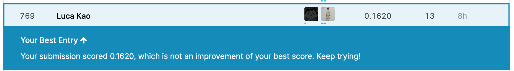
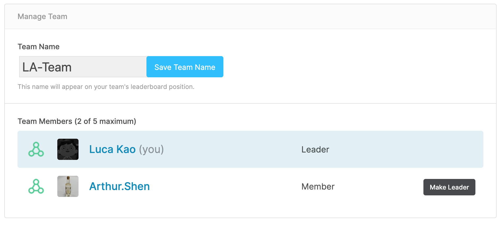
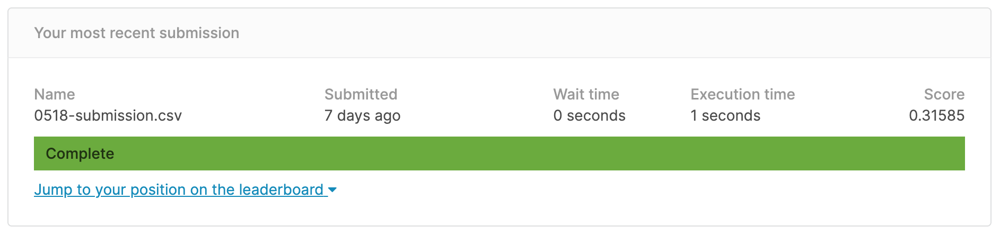
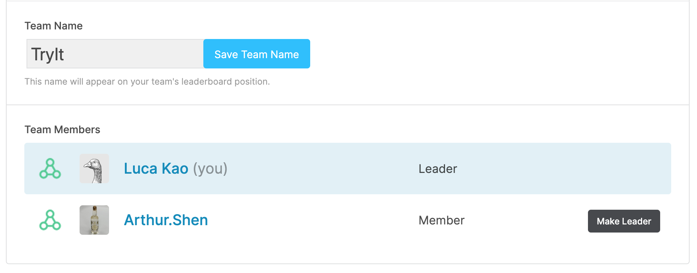
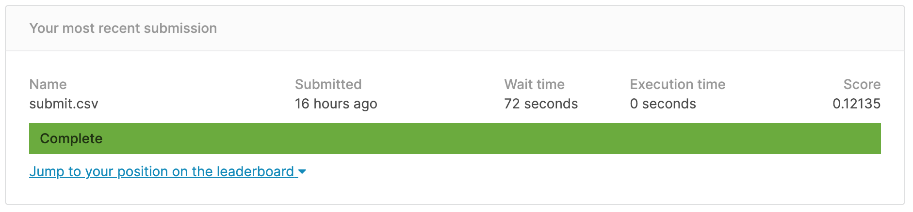
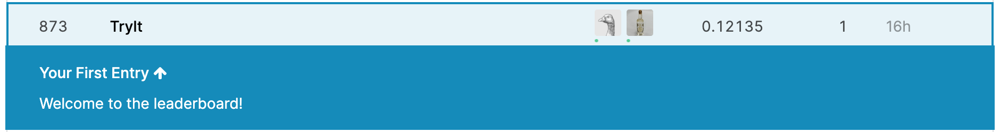

# Introduction to Deep Learning
- NCU-CS-HW


## Kaggle lab2 member
- TreNDS_hw.ipnyb
- Arthur_lab3.ipynb

## Kaggle lab3 Rank


## Report - lab3.docx


參考資料: 
http://www3.stat.sinica.edu.tw/brain/RF1/RF1.html
https://www.researchgate.net/figure/Functional-network-connectivity-FNC-and-classification-the-first-step-in-FNC-is-to_fig1_256542357
https://www.airitilibrary.com/Publication/alDetailedMesh?docid=P20160822001-201312-201608220034-201608220034-17-26
https://keras.io/zh/metrics/
https://www.kaggle.com/rohitsingh9990/trends-eda-visualization-simple-baseline


# Lab2.
## Herbarium 2020 - FGVC7
Identify plant species from herbarium specimens. Data from New York Botanical Garden.
###  Submission Format
For each image Id, you should predict the corresponding image label ("category_id") in the Predicted column. The submission file should have the following format:

Id,Predicted
0,0
1,27
2,42
...

#### link: https://www.kaggle.com/c/herbarium-2020-fgvc7/overview/description


## Kaggle lab2 member

## Kaggle lab2 Score

## Kaggle lab2 Rank


-----------------------------

# Lab1.
## House Prices: Advanced Regression Techniques:
###  -Predict sales prices and practice feature engineering, RFs, and gradient boosting

#### link: https://www.kaggle.com/c/house-prices-advanced-regression-techniques/notebooks

### Step:
```
 1.導入數據觀察每個變量特徵的意義以及對於房價的重要程度
 2.篩選出主要影響房價的數值
 3.清洗和轉換數值
 4.測試和輸出數據
```

## Kaggle lab1 member

## Kaggle lab1 Score

## Kaggle lab1 Rank

